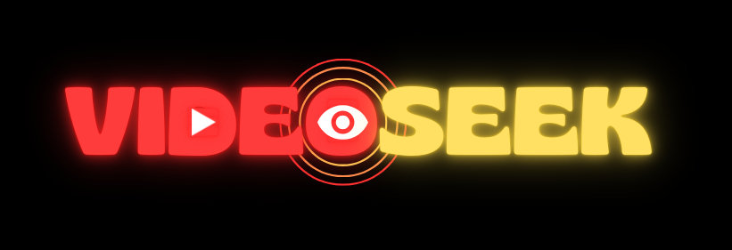

# VideoSeek 👁️‍🗨️

VideoSeek is an intelligent video search tool that allows users to find specific moments in YouTube videos by describing what they're looking for in natural language. Instead of manually scrubbing through videos, simply enter a text prompt and VideoSeek will take you to the relevant timestamp.




## Getting Started

It is currently hosted on streamlit, you can test it [here](https://videoseek.streamlit.app/).


## 🌟 Features

- **YouTube Video Processing**: Automatically downloads and processes audio from YouTube videos
- **Natural Language Search**: Find specific moments using everyday language
- **Smart Text Matching**: Utilizes advanced AI models to understand context and find relevant segments
- **Instant Playback**: Automatically starts YouTube playback at the matched timestamp
- **User-Friendly Interface**: Clean, intuitive Streamlit-based web interface

### Prerequisites

Make sure you have Python 3.7+ installed. You'll need the following packages:

```bash
pip install streamlit pillow whisper-openai yt-dlp torch sentence-transformers
```

### Installation

1. Clone the repository:
```bash
git clone https://github.com/yourusername/videoseek.git
cd videoseek
```

2. Install dependencies:
```bash
pip install -r requirements.txt
```

3. Run the application:
```bash
streamlit run app.py
```

## Usage

1. Open the application in your web browser
2. Paste a YouTube URL into the URL input field
3. Enter your search prompt describing what you want to find in the video
4. Click "Submit" and wait for VideoSeek to process your request
5. The video will automatically start playing at the most relevant timestamp

### Example

```plaintext
URL: https://www.youtube.com/watch?v=example
Prompt: "machine learning"
```

## Technical Details

VideoSeek uses several powerful technologies:

- **Whisper**: OpenAI's speech recognition model for accurate transcription
- **Sentence Transformers**: For semantic text matching between prompts and transcripts
- **yt-dlp**: For reliable YouTube video downloading
- **Streamlit**: For the web interface

## Limitations

- Maximum video length: 30 minutes

## Privacy & Security

- Downloaded audio files are automatically deleted after processing
- No user data is stored
- All processing happens locally on the server

## Contributing

Contributions are welcome! Please feel free to submit a Pull Request. For major changes, please open an issue first to discuss what you would like to change.

1. Fork the repository
2. Create your feature branch (`git checkout -b feature/AmazingFeature`)
3. Commit your changes (`git commit -m 'Add some AmazingFeature'`)
4. Push to the branch (`git push origin feature/AmazingFeature`)
5. Open a Pull Request

## 📄 License

This project is licensed under the MIT License - see the [LICENSE](LICENSE) file for details.

## Acknowledgments

- OpenAI for the Whisper model
- Sentence Transformers team
- Streamlit community
- yt-dlp maintainers

## Contact

For support or queries, please open an issue in the GitHub repository.

---

Made with ❤️ by [Fer14]